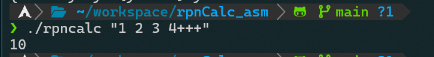

## 逆ポーランド記法電卓 on X86_64



### ビルド方法
ビルドにはNetwide Assembler(`nasm`), GNU ld(`ld`), GNU make(`make`)が必要。

```sh
$ make
```

### エラー
#### `Stack underflowed.`
スタックに積まれた値より多く加算を行ったときに発生します。(-1段目のスタックにアクセスしたとき)

#### `Stack overflowed.`
確保したスタックより多く値を積んだときに発生します。(main.asm内のSTACK_DAN+1番目のスタックに積もうとしたとき)

